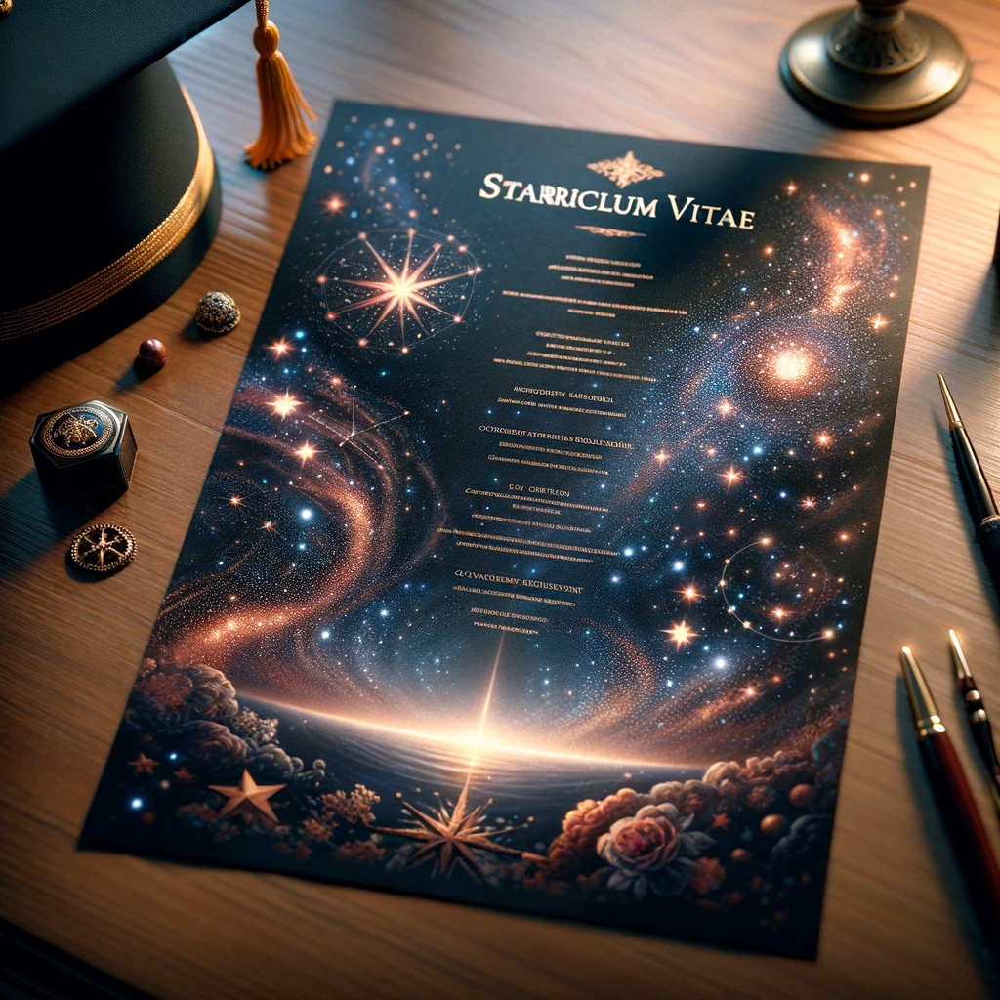
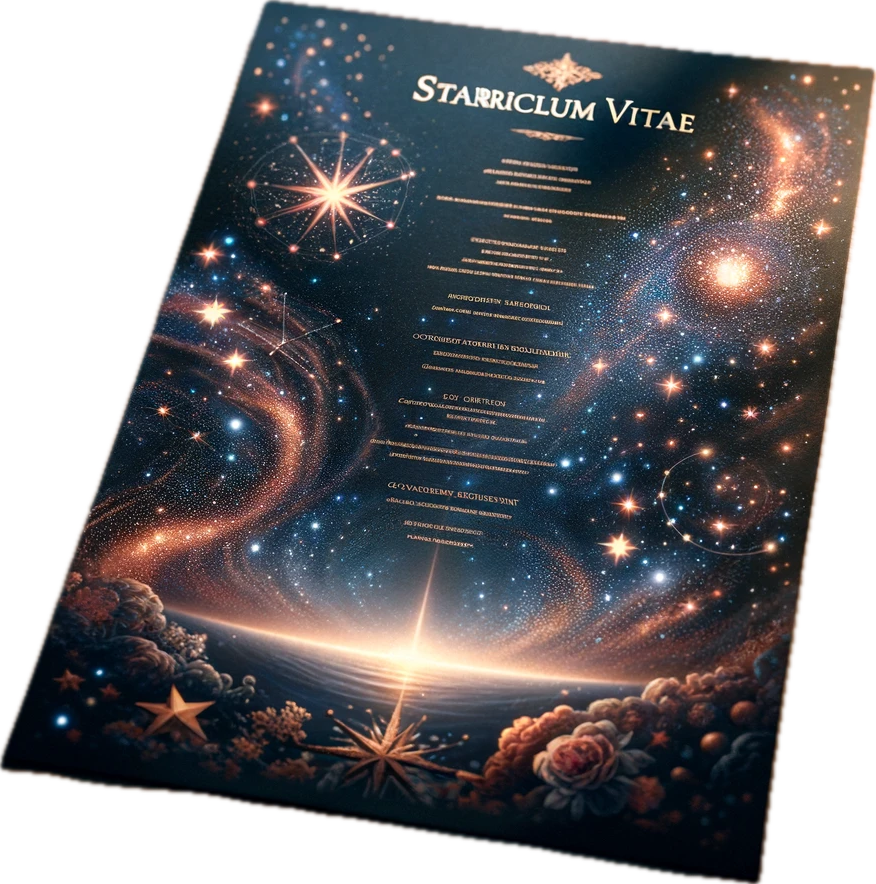

# Starriculum Vitae⭐🎓

**_All the reasons why you should ~~or shouldn't~~ hire me._**

---

<b><a href="https://illyastarikov.github.io/resume/illya-starikov-resume.pdf">Résumé</a></b>
     [<a href="https://illyastarikov.github.io/resume/illya-starikov-resume-dark.pdf">Dark</a>] 
<b><a href="https://illyastarikov.github.io/resume/illya-starikov-cv.pdf">Curriculum Vitae</a></b>
     [<a href="https://illyastarikov.github.io/resume/illya-starikov-cv-dark.pdf">Dark</a>] 
<b><a href="http://github.com/illyaStarikov/resume/">Source Code</a></b>
     [<a href="https://illyastarikov.github.io/resume/">README</a>] 

---

The resume has two targets:

- **Resume**, or "summary", gives the highest-level summary of experience
- **Curriculum Vitae (CV)**, or "course of life", should be the entire course of experience, regardless of page length

This is a departure from the typical definition of CV used in academia, but it was the best terminology I could think of. CV is intended to be a supplement to the resume, not actually for standalone use.

*Resume should be used as the catch-all term for {resume, cv, resume-dark, etc.}.*

## Design Philosophy

- *Resume*
     - *objective* be as skimmable as possible
    - 10 pt, 10 x 8.5 in (letterpaper)
    -  one-two pages
- *CV*
    - *objective* list everything in a palatable format
    - 11 pt, 8.3 x 11.7 in (a4paper)
    - unlimited pages
    - with less horizontal space, all single lines of text should fit to column in CV
    - contains experimental changes

### Formatting

- Standard formats:
    - dates `DD/MM/YY`
    - durations `Yy Mm Dz`
- .5 in-1 in margins across the entire resume
- Use rules for grouping experience, but minimize the use of lines throughout the rest of the resume
- Use font attributes to separate text, as follows:
    - **bold** for things you wish to callout (i.e., role and company)
    - normal for things that are relevant but aren't the main point (i.e., team name)
    - *italics* for things that is might be required, but generally not relevant after first glance (industry, location)
    - `verbatim` for things that should not by ambigious (i.e., dates), or might need to align vertically via monospace font (i.e., dates)
- Links are encouraged but only if helpful. Rules are subjective.
     - This that are helpful when linked to: employers, colleges, locations (to maps), tools and jargon, accomplishments, products.
- Use of color should be discouraged unless it is an icon
- Use of images should be discouraged unless it is an icon
- Icons should be tasteful, as humans can process a an icon faster than text, but can get overwhelming
- Icons should follow a standardize (to reduce PDF space)
    - 256x256 is the preferred size for high-quality logos

### Writing

- Separators (comma, semicolon, pipe) are going to appear naturally in the resume body, therefore they should be minimized as a separator in the headers. Prefer bold and italics.
- Every sentence should start with an "action" verb

## About The Author

This my true resume, please be respectful. I am human.

Personally identifiable information is scrubbed in two ways: hard and soft. Hard scrubbing is clear, it'll be censored with `X`s or not present in the source code (see [source README](src/README.md)). Soft scrubbing uses stand-ins for true info, such as replacing a specific campus with a larger one. Some information might be aggregated for simplicity (i.e., roles not broken out by levels).

## License, Copyright

I don't know how licenses work. Feel free to fork freely.

---

    <i>You can't connect the dots looking forward; you can only connect them looking backwards. So you have to trust that the dots will somehow connect in your future. You have to trust in something — your gut, destiny, life, karma, whatever. This approach has never let me down, and it has made all the difference in my life.</i> <b>Steve Jobs</b>

