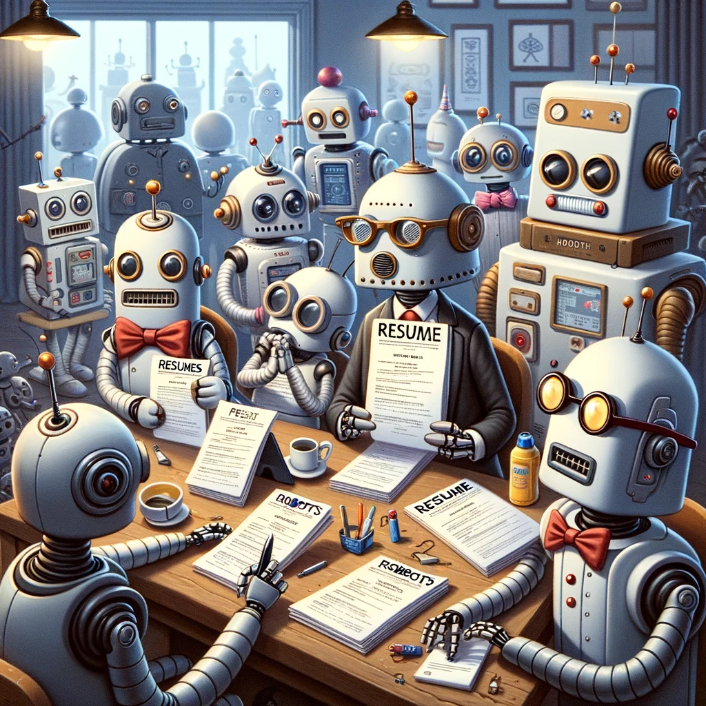

# Source Code🛠️🎓

<script src="https://resume.starikov.io/template/analytics.js"></script>

**_Built by humans, for humans._**

<p align="center"></p>

The included source code is my unedited resume source, with Personally Identifiable Information (PII) filtered out.

This is effectively a mirror of a reference resume repository. That reference repository contains the PII, assets, and production resume PDFs. For consistent terminology:

- This external mirror is called the *public repository*
- The internal reference is called the *private repository*


## LaTeX

LaTeX is chosen, as its typesetting, programming features, and difficulty-of-use is unparalleled. General rules of thumb:

- Use math mode for all numbers, preferably bold.
- Columns ~< 120

Relevant docs:

- [FontAwesome](https://mirror.las.iastate.edu/tex-archive/fonts/fontawesome/doc/fontawesome.pdf)
- [Math](https://tug.ctan.org/info/undergradmath/undergradmath.pdf)
- [siunitx](https://ctan.math.illinois.edu/macros/latex/contrib/siunitx/siunitx.pdf)
- [xcolor](https://steeven9.github.io/USI-LaTeX/html/packages_hyperref_babel_xcolor3.html)

### Alternatives Considered

*(.i.e., why not just use X?)*

The only alternative considered was ModernCV, but a custom solution was created to fit content to a single page more efficiently.

There is an argument to be made that resume scanning software used is optimized for Word, Docs, Pages. However, if a company is disregarding candidates because their CMS couldn't handle LaTeX resumes, maybe I too want to be in the discard pile. Resumes built for humans vs. resumes built for algorithms have wildly different objectives; I side with the humans.

_Built by humans, for humans._


## makefile

There are two main make commands that are relevant:

- `make all` or `make` builds all the resume targets
- `make clean` cleans all the artifacts

There are several "targets", laid out by booleans in the LaTeX source. Enabling booleans changes the behaviors of the resume.

- `ntk` Need-To-Know, usually containing Personally Identifiable Information such as phone numbers, addresses, or even dates. The `ifthenelse` is wrapped from easy filtering. See makefile for more information.
- `displaycv` Expands to include all the public content, for easy previewing.
- `displaycontact` Outputs the un-censored phone numbers, addresses, etc. This is different from "ntk", as controls solely contact fields and not the whole resume.
- `displaycolor` Swaps in high-quality color logos with comparable quality FontAwesome icons.
-  `displaycensored` Censors any identifiable information. Intended to review resume without employer bias or to provide anonymous feedback.

All dependencies are listed here.


## Assets

Assets with copyright implications (images, fonts, logos) is not included, for copyright and respect of others.

However, here are sources you can get these:

- [Lovelo](https://www.fontfabric.com/fonts/lovelo/)
- [FontAwesome](https://fontawesome.com)
- [Flags](https://www.countryflags.com/)


## Directory Structure

The source code is unedited, however the directory structure is.

- For *this public repository* the output files in this directory are all bundled under the `src`.
- For *the private repository*, the `makefile` is at the top level while the rest of the source is in the `src` folder.

```
.
├── README.md
├── makefile
├── pdf
│   ├── cv
│   │   └── illya-starikov-resume.pdf
│   ├── cv-dark
│   │   └── illya-starikov-resume.pdf
│   ├── ...
│   └── resume-redacted-dark
│       └── illya-starikov-resume.pdf
├── resume
│   ├── LICENSE
│   └── README.md
├── src
│   ├── Fontin-Bold.otf
│   ├── ...
│   ├── Fontin.otf
│   ├── illya-starikov-resume.tex
│   └── macros.tex
└── template
    ├── de-soto-senior-high-color.png
    ├── sunrise-r9-color.png
    ├── ...
    └── ukraine.png
```


## Credit

This is a fork from [Natasha Jarus's](https://natashajar.us) resume, modeled in both design and content.


---

> Science is what we understand well enough to explain to a computer. Art is everything else we do. **Donald Knuth**

